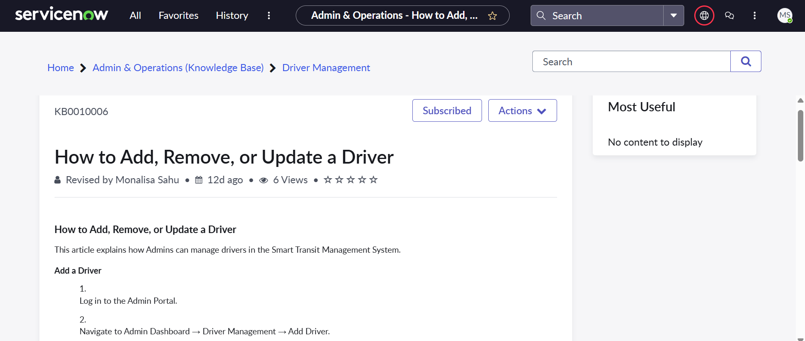
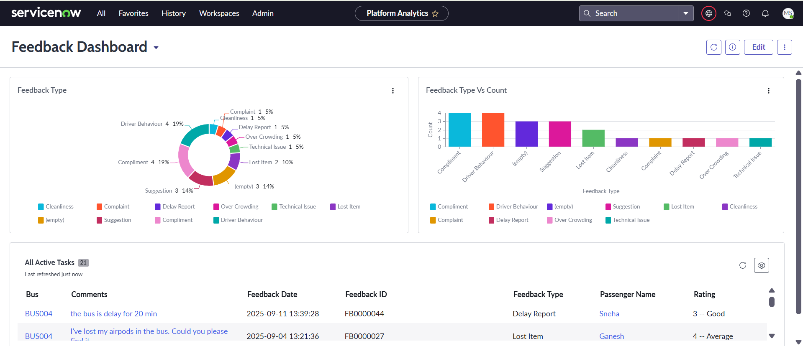

# 🚍 Smart Transit Management System (ServiceNow)

---

## 📌 Project Summary
The **Smart Transit Management System (STMS)** is a ServiceNow-based solution designed to **streamline and automate bus transit operations**. It provides an integrated platform to manage passengers, drivers, buses, schedules, and payments efficiently.  

Key capabilities include:  
- **Passengers:** Book/manage tickets, provide feedback, and make payments.  
- **Drivers:** Access assignments, schedules, and route details.  
- **Administrators:** Monitor buses, manage routes, generate reports, and oversee operations.  

All functionality is packaged in a **ServiceNow Update Set (`update_set.xml`)** for easy deployment.

---

## 🛠️ Skills & Tools
- **ServiceNow Platform:** Tables, Forms, Lists, Studio, Flow Designer, Business Rules (with scripting for automation), Notifications, Catalog Items, Reporting, Dashboards, Knowledge Base  
- **Soft Skills:** Requirement Analysis, Problem Solving, Documentation, Team Collaboration  

---

## 📂 Implemented Tables
The system utilizes custom tables to organize transit data:  
- **Passenger** – Tracks passenger information and registration  
- **Driver** – Stores driver details and assignments  
- **Bus** – Records bus information and operational status  
- **Bookings** – Maintains seat reservation records  
- **Tickets** – Tracks ticket status (Booked, Completed, Cancelled)  
- **Payments** – Logs payment details with auto-generated IDs  
- **Feedback** – Captures passenger reviews and ratings  
- **Schedule** – Maintains bus timings and availability  
- **Route** – Defines start, end, and intermediate stops  
- **GPS Tracking** – Shows real-time bus location  
- **Prices** – Stores fare details between points  

---

## ⚙️ Workflows & Automation
STMS includes automated flows and business rules to streamline operations:  
- **Auto ID Generation:** Assigns Bus ID, Booking ID, Payment ID, etc. automatically  
- **Passenger Registration Flow:** Creates a passenger record and sends confirmation emails  
- **Feedback Flow:** Sends notifications to admins when new feedback is submitted  
- **Booking Flow:** Updates booking statuses automatically  
- **Payment Processing Flow:** Validates transactions and updates ticket statuses  
- **Ticket & Schedule Management:** Completes expired tickets and validates schedules automatically  
- **Reporting Flow:** Generates daily operational reports and emails them to administrators  

---

## 📊 Dashboards
Interactive dashboards provide insights into:  
- **Bus Operations:** Active vs maintenance buses, buses by route, driver performance metrics  
- **Passenger Feedback:** Ratings and comments distribution  
- **Payments:** Transaction summaries, revenue by day, payment methods used  
- **Routes:** Usage analytics and performance monitoring  

---

## 📑 Service Catalog
STMS offers several service catalog items to enhance passenger experience:  
- **Book a Ticket** – Reserve seats on scheduled buses  
- **Cancel a Ticket** – Submit cancellation requests  
- **Bus Maintenance Request** – Request bus repair or maintenance  
- **Report Lost Item** – Report any lost belongings during travel  
- **Request Refund** – Submit financial service requests  

---

## 📖 Knowledge Base
A structured knowledge base is available for support:  
- **Admin & Operations:** Guidelines on route setup, driver management, and reporting  
- **Driver Support:** Instructions for viewing assignments  
- **Passenger Support:** Guides for booking tickets  

---
## Screenshots

### 1. Bus Management Dashboard

### 2. Driver Management Knowledge Base

### 3. Driver Table

### 4. Feedback Dashboard

---

## 🚀 Deployment Instructions
To deploy the system in your ServiceNow instance:  
1. Navigate to **System Update Sets → Retrieved Update Sets**  
2. Click **Import Update Set from XML**  
3. Upload the `update_set.xml` file  
4. Preview the changes  
5. Commit the update set to apply all configurations  

---

## 📂 Repository Structure

**Smart-Transit-Management-System/**

- **Documents/** # Project documents and reports
  - Smart_Transit_Management_System_Final_Report.pdf
  - Smart_Transit_Management_System_PPT.pptx

- **Screenshots/** # Screenshots and images for dashboards, tables, KB, etc.
  - Bus Management Dashboard.png
  - Driver Management KB.png
  - Driver Table.png
  - Feedback Dashboard.png
  - Knowledge_Base.png
  - ServiceNow_Logo.jpg
  - UI_page.png

- `update_set.xml` # ServiceNow Update Set for deployment

- `README.md` # Project overview and instructions

---

## 👥 Team Members
This project was developed by:

- **Monalisa Sahu**  
- **Zeeth K**  
- **Gangothri Madduru**  
- **Ganesh Nanavath**  
- **Sivadharane S**  
- **Kothakonda Navadeep**  
- **Lakshitha RE**  
- **Anisha G**  
- **Mounika Jaya Veerapalli**
